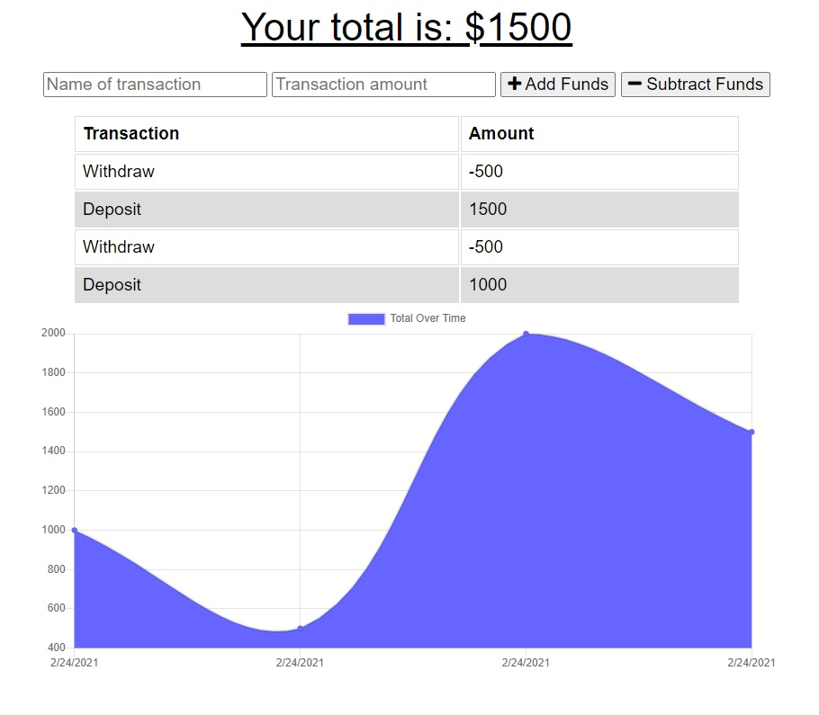

<h1 align="center"> Budget Tracker </h1>

## Table of Contents
- [Description](#description)
- [Installation](#install)
- [Deployment](#deployed) 
- [Screenshot](#screenshot)
- [License](#license)
- [Questions](#questions)

## Description
A budget tracker app that allows the user to be able to add expenses and deposits to their budget with or without a connection. When entering transactions offline, they should populate the total when brought back online.

## Installation
- npm install
- npm start

## Deployed Site
https://serene-refuge-74083.herokuapp.com/

## Screenshot

## License

## Questions
Github: https://github.com/esober101

Email: ericscottober@gmail.com